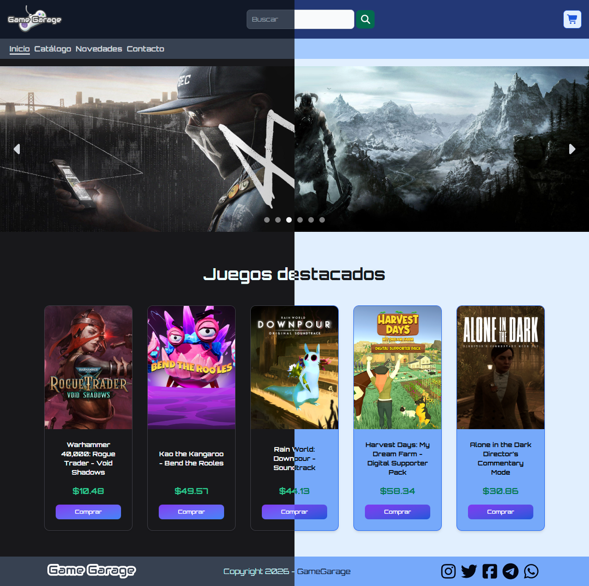
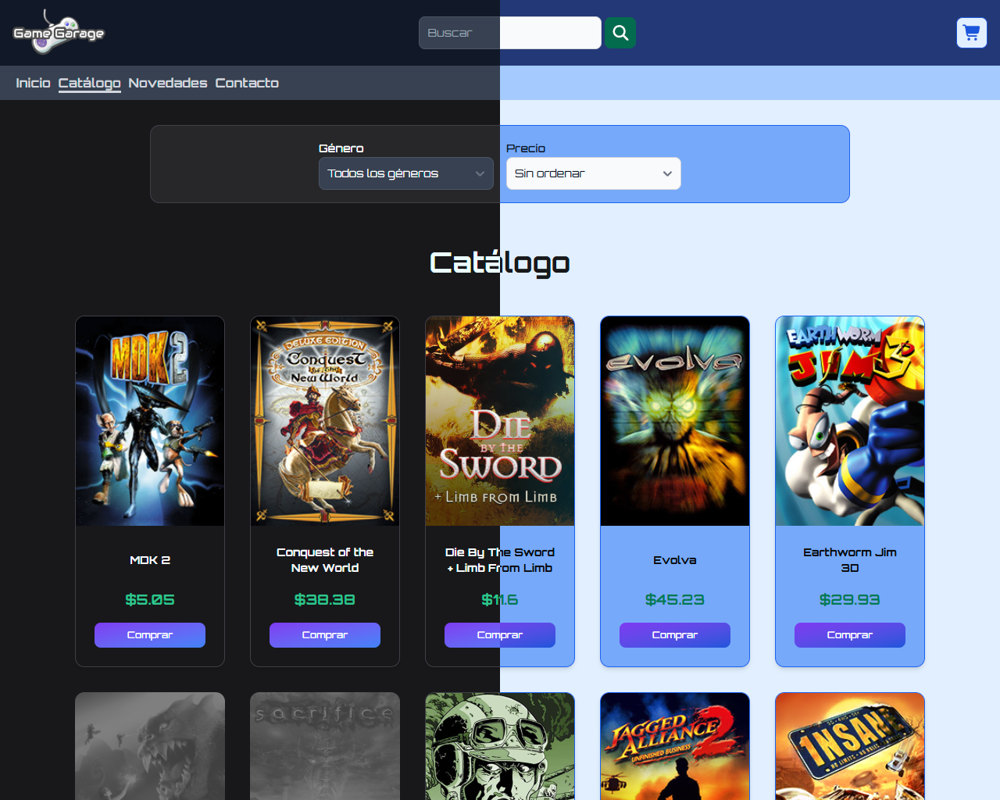
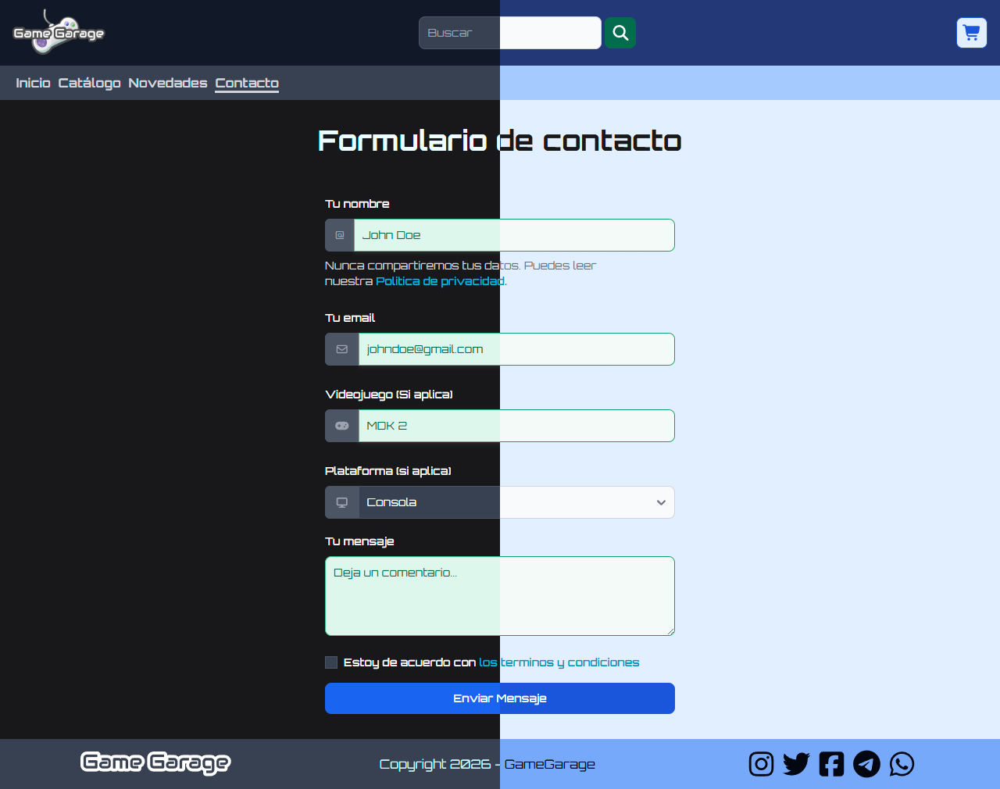

# GameGarage - Tienda Online de Videojuegos

## Descripción del proyecto

Nos propusimos crear el frontEnd de una tienda de videojuegos, utilizando los principales sitios del rubro (steam, GoG, Epic) y otros sitios de venta on-line (frávega, carrefour, etc) como referencia para el layout.

## Tecnologías aplicadas

### Estructura del sitio

+ [React](https://es.react.dev/)
+ [React router](https://reactrouter.com/)

### Apartado Visual

+ [Tailwind CSS](https://tailwindcss.com/)
+ [Flowbite-React](https://flowbite-react.com/)
+ [FontAwesome](https://fontawesome.com/)

## Instalación local

1. clonar el repositorio

```bash
git clone https://github.com/LeonardoMuranodev/tienda_online_videojuegos.git
cd tienda_online_videojuegos
```

2. instalar las dependencias

```bash
npm install
```

3. ejecutar el proyecto

```bash
npm run dev
```

## Screenshots

### Inicio



### Catálogo



### Contacto



## 🚀 Despliegue

Este proyecto se encuentra desplegado y en producción utilizando **Netlify**. 

Puedes acceder a la versión en vivo de la aplicación haciendo clic en el siguiente enlace:

🔗 **[Game Garage - Live Demo](https://game-garage.netlify.app/)**

## Integrantes

+ Leonardo Murano
+ Dylan Correa
+ Agustin Fernandes
+ Tomas Rosales
+ Matias de la Rosa